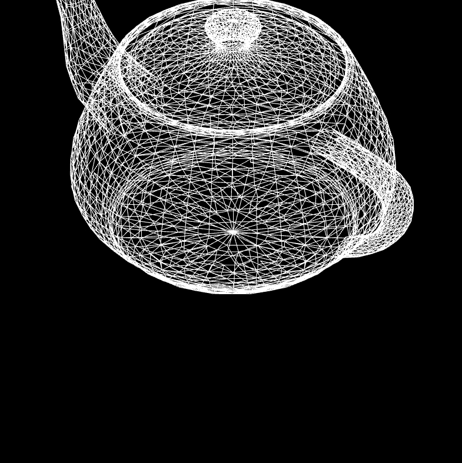
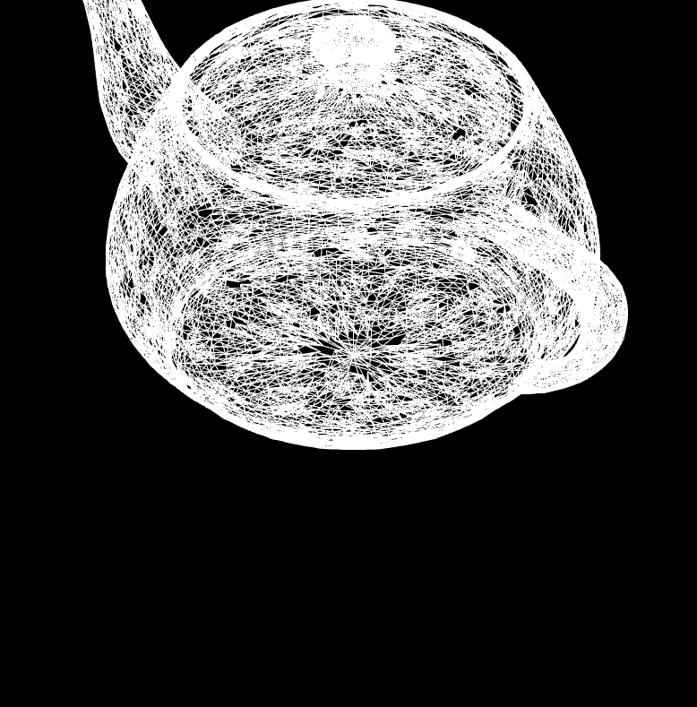

## LoopSubdivision

### Getting Started
> You can also download [release](https://github.com/ZXPrism/LoopSubdivision/releases/).

- Please make sure you have at lease one compilers installed on your computer and set related environment variables correctly.

- Install [xmake](https://github.com/xmake-io/xmake/releases).

- Run command `xmake` under **the project root folder**(i.e. the folder of `xmake.lua`)

  - xmake will automatically install necessary dependencies and build the project
  - Since most dependencies are maintained on GitHub, you may encounter network issues during this step. I believe that you can solve them by yourself.

- You will find the binary under folder `bin`.

### Usage
Use command `lsdemo <obj file path>` to load a model(in Wavefront OBJ format).

Press `x` (case insensitive) to perform Loop Subdivision on the model.

### Note
- I provide several models(generated by blender) for test, you can find them under folder `bin/model` (or `src/model`).

- As the number of faces / edges / vertices grows **exponentially**, it often takes long time to calculate.

- So don't press too fast & too many times!

### Sample

